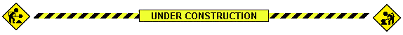

# Skill Zoo

A deliberately small collection of failure-driven skills for AI coding agents. Every resident instruction pays rent in tokens. **Skills are useful. Context isn't free.** Make it earn its room.

<p align="center">
  
</p>

## What belongs here?

A skill must justify:

1. **Existence** — What concrete failure does it prevent?
2. **Residency** — Why must it stay in permanent context?
3. **Claim** — What evidence supports what we say it does?

Useful does not automatically mean resident.

```text
installed ≠ resident ≠ invoked
```

The current resident budget is deliberately small. These are ceilings, not targets:

```text
5 files
50 KB
```

## Philosophy

Real work creates candidates. No new skill is a valid outcome.

```text
recurring failure
→ local rule
→ survives use
→ candidate skill
→ admit / on-demand / local / reject
```

See [`CONSTITUTION.md`](CONSTITUTION.md) for the operating rules.

---

**WE HAVE TWO FILES. PLEASE CALM DOWN.**

